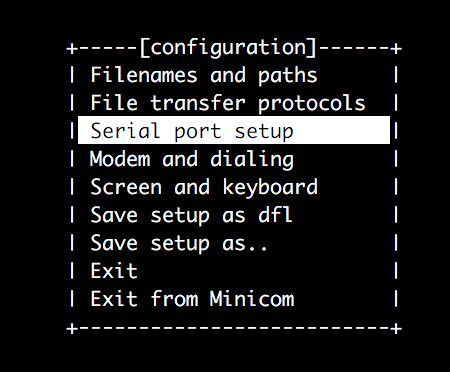
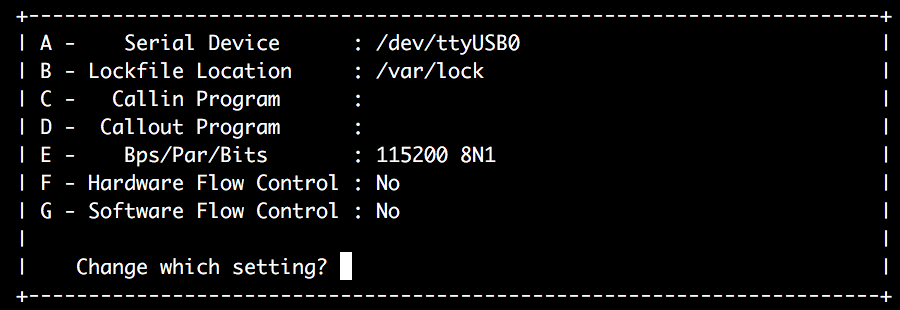

# Hello World 訊息--顯示Log訊息(mini com)

教導如用使用mini com作為開發除錯工具，第一步將教導如先用Arduino IDE
寫一個Hello World程式燒錄至MT7697上，讓mini com將Log訊息顯示在終端機上。

## MT7697 Arduino IDE 開發

## Minicom

Minicom是一個基於文本的串口通訊程序。它用於與外部RS-232設備（如手機，路由器和串行控制台端口）通信。

### 安裝minicom
在Linux開啟終端機輸入下列指令就可以安裝Linux
```
sudo apt-get install minicom
```

### 查尋device port
當usb插上Linux將/dev 將產生一個node，將會命為/dev/USBx(x為數字序號),可以從下demsg查尋。

```
sudo demsg
```
此時終端機將會輸出約如下畫面，注意他與usb連接為ttyUSB0
```
[  242.618254] usb 2-2: SerialNumber: 0001
[  243.662352] usbcore: registered new interface driver usbserial
[  243.662591] usbcore: registered new interface driver usbserial_generic
[  243.662661] usbserial: USB Serial support registered for generic
[  243.665093] usbcore: registered new interface driver cp210x
[  243.665198] usbserial: USB Serial support registered for cp210x
[  243.665216] cp210x 2-2:1.0: cp210x converter detected
[  243.697994] usb 2-2: cp210x converter now attached to ttyUSB0
```

由上文可以看Linux系統配ttyUSB0給MT7697。我們將需要使用Minicom與USB0連接。接下來，進入終端輸入：
```
sudo minicom -s
```


選擇Serial port setup，將會開啟如下

- Serial Device:為uart port，輸入MT7697連接至作業系統給於埠
- Bps:Baud rate一般典型的是300, 1200, 2400, 9600, 19200, 115200等
- Hardware Flow:設為No

設定完按下Enter離開。
在終端機上輸入
```
sudo minicom
```
結果如下圖

