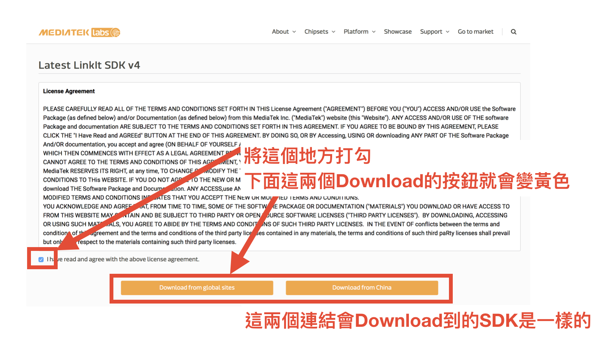
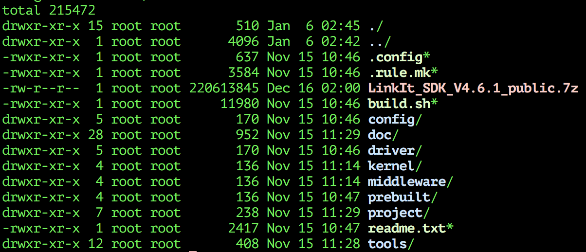
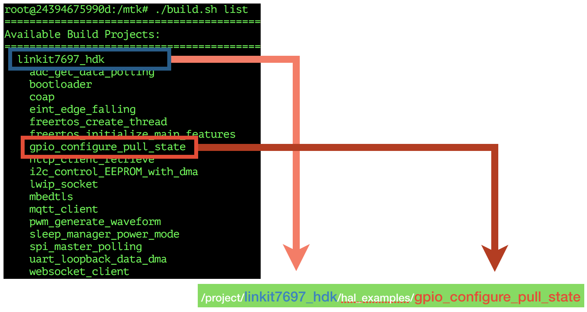
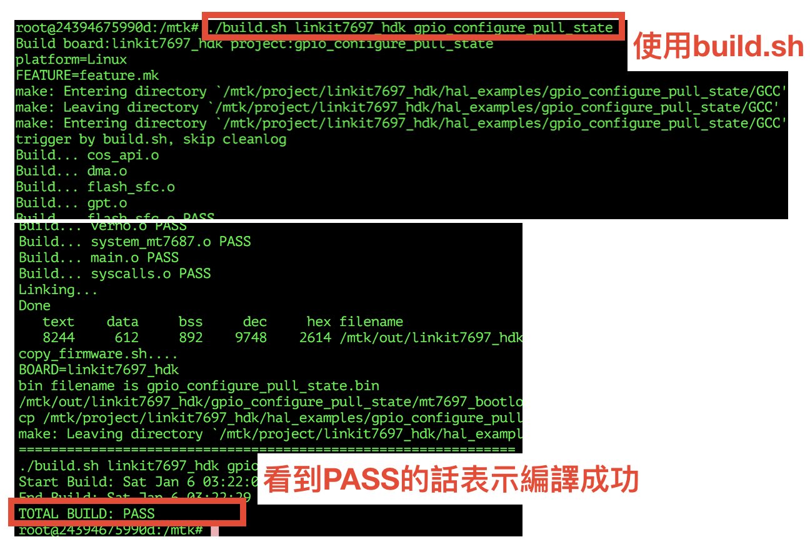
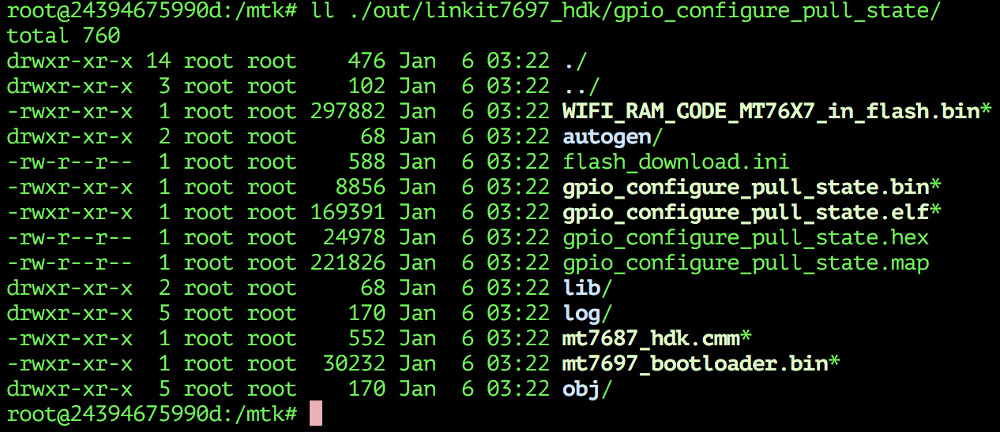

# Linux 環境建置

使用ubuntu 14.04 [1] 做為開發環境。準備好ubuntu作業系統之後，先進行更新套件資訊與安裝相關套件。

打開 console ，輸入下列指令

```
sudo apt-get update
sudo apt-get install -y build-essential vim p7zip
sudo dpkg --add-architecture i386 
sudo apt-get update
sudo apt-get install -y libc6-i386
```

# 下載 MTK 官方提供SDK包

到下面官方連結

```
https://docs.labs.mediatek.com/resource/mt7687-mt7697/en/get-started-linkit-7697-hdk/gcc-arm-embedded-linkit-7697/get-linkit-sdk-linkit-7697
```
找到下面這個給一般使用者的連結


點下黃色連結之後會進入下一個畫面，照圖示點選之後就會開始下載MTK官方提供的SDK包。



Download之後的檔案檔名會類似下面的形式
```
LinkIt_SDK_Vx.y.x_public.7z
```
x.y.z 為版本號碼。在撰文時期所Download的檔名為 `LinkIt_SDK_V4.6.1_public.7z`。


# 解壓縮SDK包到指定目錄

這邊假設在家目錄底下建立一個叫 `mtk` 的資料夾用來放置SDK的檔案。

```
mkdir ~/mdk
cd ~/mdk
mv xxxx/LinkIt_SDK_V4.6.1_public.7z ~/mdk
```

然後在使用下面指令開始解壓縮

```
7zr x LinkIt_SDK_V4.6.1_public.7z
```

成功的話會看到下圖這些檔案



# 編譯範例程式專案

這個時候可以用指 mtk 準備好的指令工具 `build.sh` 來列出mtk官方準備好的
example project，如下圖所示。我們準備編譯官方包裡面 `linkit7697_hdk` 
的範例專案  `gpio_configure_pull_state` 。



上圖顯示了，`linkit7696_hdk` 和 `gpio_configure_pull_state` 這兩個目錄的位置。
`linkit7697_hdk` 是一個開發板目錄，該目錄用來放置 MT7697 開發板的專案。
而 `gpio_configure_pull_state` 則是專案目錄。可以進去 `project/linkit7697_hdk/` 
目錄觀察一下其他專案目錄的路逕，應可以發現 `build.sh list` 是對 `project` 目錄
進行掃描的動作，並且列出所有開發板目錄名稱與各個開發板目錄下所有專案目錄。

工具程式 `build.sh`可以用指定 `開發板目錄名稱` 和 `專案目錄名稱` 的方式進行編譯。指令的下法如下所示。

```
./build.sh <開發板目錄名稱> <專案目錄名稱>
```

所以要編譯 開發板 `linkit7697_hdk` 下的 專案 `gpio_configure_pull_state` 的話指令要這樣下

```
./build.sh linkit7697_hdk gpio_configure_pull_state
```

下圖為執行的情形。如果最後看到 `PASS` 表示編譯成功完成。



編譯完成的 binary 檔會放置在 `out` 目錄下，並以 `<開發板目錄名稱>/<專案目錄目稱>` 的形式存放，產生的檔案如下圖。



可以看到 `WIFI_RAM_CODE_MT76X7_in_flash.bin` 和 `gpio_configure_pull_state.bin` 就是等一下要 upload 到MT7697 開發板上的二進位檔。

# ----

